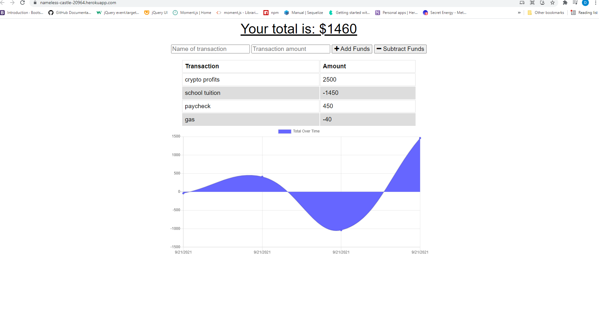
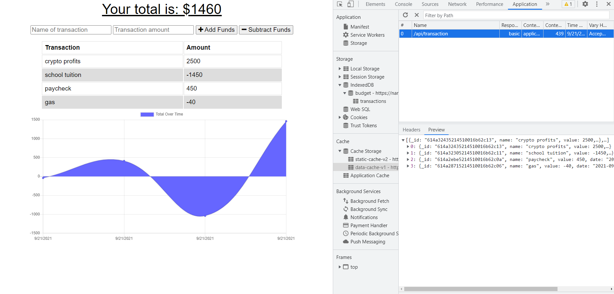
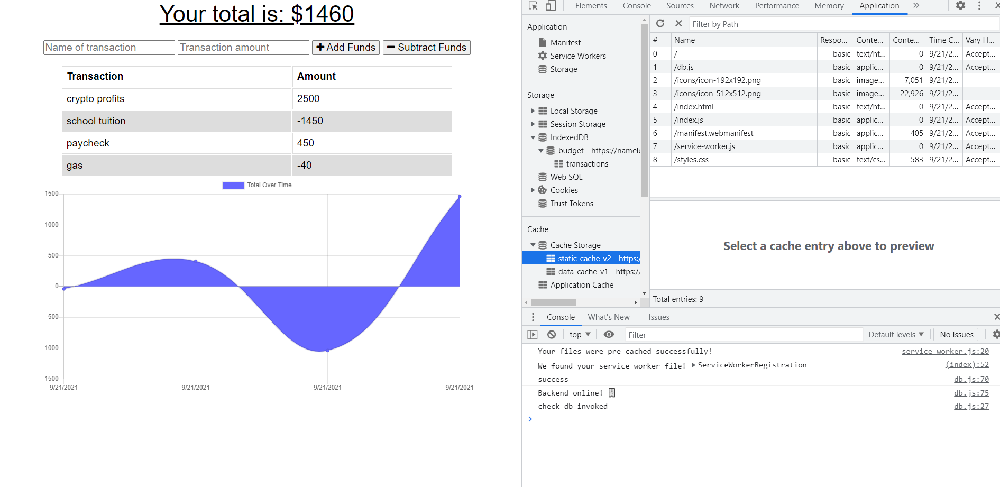

# PWA-Offline-Budget-Tracker
This Budget Tracker application allows for offline access and functionality by utilizing indexedDB. Users are allowed to enter expenses and income offline that will load the cached data once the user is back online. The back-end is connected to a MongoDB database and deployed live via Heroku.

## Demo
- Live app is [here](https://nameless-castle-20964.herokuapp.com/)

